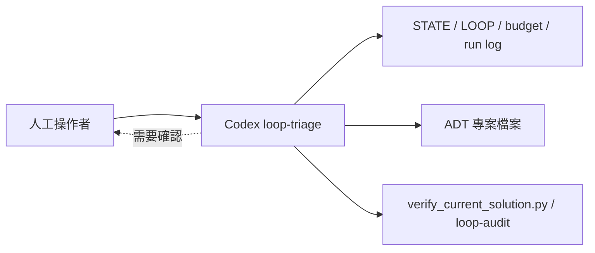
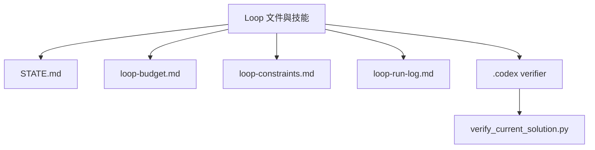
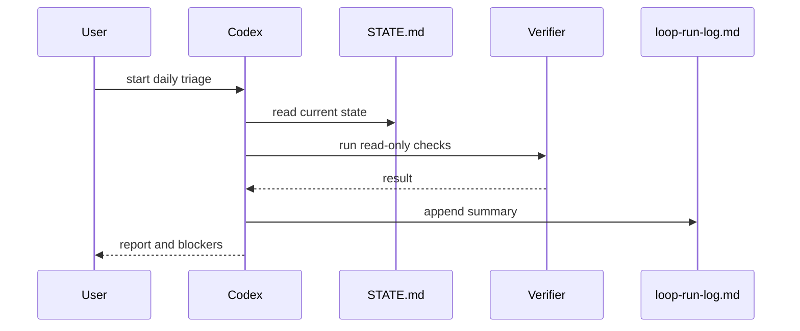
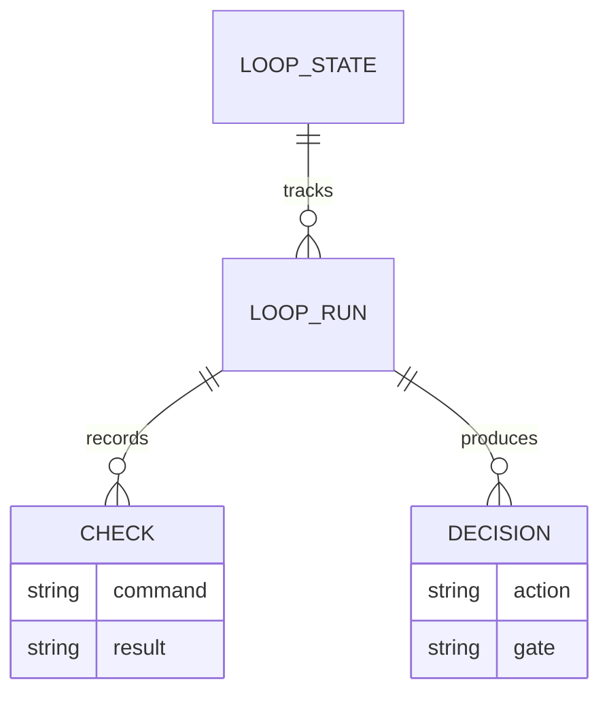
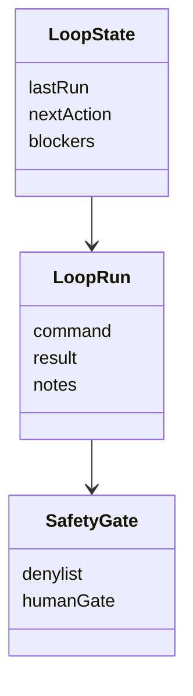
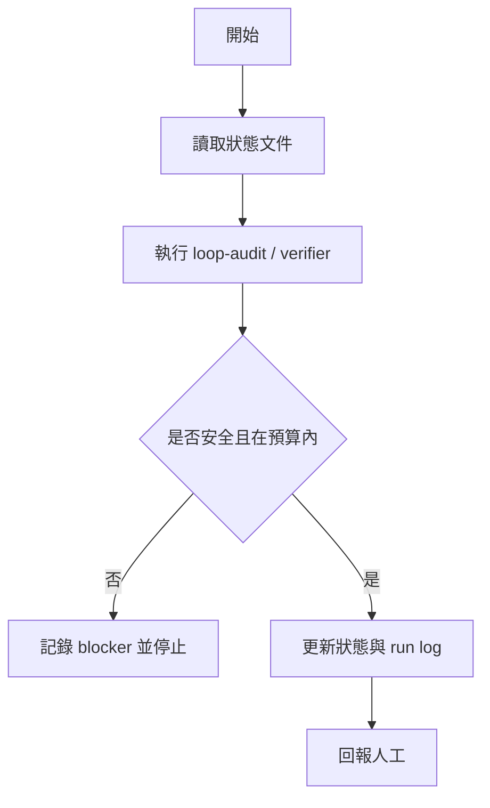
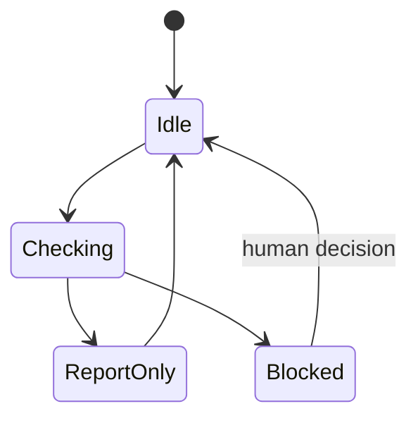

# 📑 ADT 系统技术规范 (spec.md)

本文件记录自动打鼓转谱 (ADT) 系统核心模型的技术规范、网络架构、超参数配置、特征维度标准以及模型性能基准。

---

## STAR conservative fine-tune note

`best_drum_model.pth` remains the main E-GMD + IDMT candidate. `best_drum_model_backup.pth` must not replace it only because one shuffle sample improves. STAR adaptation from `best_drum_model.pth` should first use a lower learning rate and fixed regression checks before producing a new candidate checkpoint.

Small STAR fine-tune batches can corrupt BatchNorm running statistics and collapse inference to a few kick events. Conservative STAR adaptation should freeze BatchNorm statistics during small-data experiments.

If BatchNorm freezing prevents collapse but still regresses fixed tests, the next conservative rung is head-only adaptation: freeze backbone and TCN layers, update only `onset_head` and `velocity_head`.

Snare recovery experiments should weight positive onset labels per channel instead of globally lowering inference thresholds. This keeps the fix in the acoustic model training path.

## Raw AI gate reporting note

`compare_blind_expected.py --layer raw` reports only model-layer counts from `raw_*` summary columns. Notation-layer virtual recovery fields must be blank in raw reports, because they describe brain/post-processing output and are not evidence that the acoustic model produced an onset.

## Raw AI hard-negative objective note

Raw AI repair candidates may use `train_mixed_datasets.py --hard-neg-boost` to up-weight non-onset frames that the current model predicts with high probability. This keeps the model architecture unchanged and focuses training on false-positive peaks instead of raising inference thresholds or adding song-specific rules.

## Raw AI teacher metadata note

Confirmed score-image annotations can mix score-time and audio-time coordinates. Raw AI repair training must not use those rows directly unless they are converted into physical audio time. A safer short path is to build temporary teacher metadata from a notation pass that already passed the user blind gate, using each event's `raw_time` as the training target.

## Raw acoustic gate note

The user blind expected CSV is a notation target and must not be used as the Raw AI acoustic acceptance gate. Raw acoustic validation must compare model raw counts only against confirmed annotations that are already in physical audio time, such as `source=raw_ai`, `source=audio_onset`, or `source=grid_fill+audio_onset`. Confirmed rows from `score_image` or plain `grid_fill` are score-time rows unless explicitly converted, so the training metadata converter must reject them by default.

## Current solution verification note

The accepted solution must be checked through one repeatable verification entrypoint. `verify_current_solution.py` runs the accepted checkpoint through the blind transcription batch, compares both raw acoustic and notation gates, then runs hard validation. A run is accepted only when every row in all three generated reports is `pass`.

## Score-time to physical-time conversion note

When notation gate already passes, score-time annotation rows can be converted to physical audio time by aligning each confirmed annotation with the same instrument occurrence in the passed `notation_events.csv`. The converted CSV must preserve the original score time in `score_time`, write the corresponding notation event `raw_time` into `time`, and set `source=notation_physical_map`. Raw acoustic expected counts may then include these converted rows.

## Channel-separated fine-tune note

When a candidate reduces Hi-Hat false positives but damages Snare recall, the next training step must separate channel objectives instead of full-model fine-tuning. `train_mixed_datasets.py --train-channels` can restrict loss to selected output channels while freezing the rest of the model through `--train-head-only`, preserving unrelated drum classes.

## 1. 核心网络架构 (SymmetricDrumTCN)

模型采用共享卷积骨干网络 (Shared CNN Backbone) 加双路对称扩张时间卷积网络 (Dilated TCN) 的解耦设计，以消除分类 (Onset) 与回归 (Velocity) 的梯度干扰和时序相位偏差。

### 1.1 骨干网络 (Shared CNN Backbone)
*   **输入通道**：2 (Channel 1: Log-Mel, Channel 2: Superflux Onset Feature)
*   **下采样层**：4 层 2D 卷积 + MaxPool2d (仅在频域维度下采样，时域保留完整分辨率)
    *   频域维度变化：$256 \to 128 \to 64 \to 32 \to 16$
*   **频域投影层**：$1 \times 1$ 卷积映射 `slot_proj` 将 $64 \times 16$ 维的通道频域级联特征，投影降维至 $64$ 维，并展平送入时序网络。

### 1.2 对称解耦时序层 (Fully-Symmetric Decoupled TCN Branches)
*   **对称分支**：
    1.  **Onset 分支**：5层因果因数扩张 TCN 块 (kernel_size=5, dilations = [1, 2, 4, 8, 16]) $\to$ 输出层 (1x1 Conv + Sigmoid) $\to$ 预测概率 [Time, 3] (Kick, Snare, Hi-Hat)
    2.  **Velocity 分支**：5层因果因数扩张 TCN 块 (kernel_size=5, dilations = [1, 2, 4, 8, 16]) $\to$ 输出层 (1x1 Conv + Sigmoid) $\to$ 预测力度值 [Time, 3] (归一化到 `[0, 1]`)

---

## 2. 信号处理与特征提取规范 (DSP Pipeline)

*   **音频采样率 (SR)**：$44100\text{ Hz}$ (单声道)
*   **帧移 (Hop Length)**：$256$ 采样点 ($\approx 5.8\text{ ms}$ / 帧)
*   **特征维度**：双通道 $256$ 维梅尔谱矩阵，时域长度固定为 $688$ 帧 ($\approx 4\text{ 秒}$)
*   **双通道特征图**：
    *   **通道 1 (Log-Mel)**：标准梅尔滤波器组提取谱图后做 Log-Power 压缩与 Z-Score 标准化。
    *   **通道 2 (Mel-domain Superflux)**：在梅尔能量域进行一阶前向差分，保留正向脉冲能量，经 1000 倍放大后通过 $\log_{10}(X + 1.0)$ 进行高清无噪压缩，消除静音段极微弱的底噪扰动。

---

## 3. 标签定义与损失函数优化 (Loss & Labels)

*   **标签平滑 (Soft Labeling)**：对 Onset 二分类独热标签（0 或 1）使用一维高斯滤波器 ($\sigma=1$) 进行平滑，降低轻微帧偏移带来的负面梯度惩罚。
*   **非对称力度 Loss**：
    *   在音符击打发生的活性区域，计算预测力度与真实力度的均方误差 (MSE)。
    *   在无击打的静音区域，引入 $(1.0 - \text{Onset}_{\text{smoothed}})$ 作为掩码乘上 $0.1$ 的极微弱惩罚权重，压制假阳性力度的同时避免过度拉低整体音符力度。
*   **$\beta$ 梯度权重分阶段调度**：
    *   **前半段训练**：设定 $\beta = 20.0$，强行撑开力度的预测幅值与敏感度。
    *   **后半段微调**：降低 $\beta = 10.0$，对模型时序定位与力度预测做联合高精度收敛微调。

---

## 4. 阶段评测指标基准 (Benchmarks)

采用统一的 GMD (244首) 与 IDMT (16首) 联合验证集进行评测。以下为最新基准：

### 4.1 纯分轨验证 (Clean Solo Validation)
*   **评估指标**：Mean F1 = **`0.910`** (Kick: `0.918`, Snare: `0.896`, Hi-Hat: `0.917`)
*   **力度误差**：Velocity RMSE = **`10.89`** (相比原旧模型误差缩小了 5 倍以上)

### 4.2 全混音与速度变化验证 (Mixed + Augmentation Validation)
*   **评估指标**：Mean F1 = **`0.861`** (Kick: `0.898`, Snare: `0.821`, Hi-Hat: `0.863`)
*   **力度误差**：Velocity RMSE = **`12.68`**

---

## 5. E-GMD 大规模数据集训练技术指标设计

为了解决原声鼓与电子鼓的声学特征泛化差距，并且完全不依赖“大脑”后处理量化调整，在 0.50 默认中值下直接听写出完美音符数量，新训练阶段采用以下规范：

### 5.1 特征工程规范
*   **特征提取**：全面退回 **标准梅尔谱 (Standard Mel Spectrogram)** 结合梅尔域无噪 Superflux（通道 1: Standard Log-Mel, 通道 2: Log-Superflux）。
*   **采样率与跳移**：SR=44100, Hop Length=256, N_MELS=256。

### 5.2 训练数据集规划
*   **数据源**：`e-gmd-v1.0.0.zip` (89.8 GB 压缩包，解压后约 100GB+)。
*   **特征存储**：使用 `convert_to_npy.py` 将所有音频转换至磁盘虚存页映射 `.npy` 原始波形文件，在训练时采用 online `extract_features` + Standard Mel 进行实时特征计算。

### 5.3 训练结果与分析 (First Run Results)
*   **E-GMD 30 Epochs 训练**: `best_drum_model.pth` 完成 30 epochs 训练。
*   **测试集评测 (`test.wav` @ 0.50 阈值)**:
    *   Kick: 45
    *   Snare: 32 (完美匹配目标)
    *   Hi-Hat: 0 (由于 E-GMD 数据集内部能量及分类占比偏好，Hi-Hat 预测概率峰值最高仅为 0.481，在 0.50 默认阈值下被全过滤)
*   **旧模型对照 (`best_drum_model_backup.pth` @ 0.20 阈值)**:
    *   Kick: 48 (完美匹配)
    *   Snare: 32 (完美匹配)
    *   Hi-Hat: 79 (几乎完美匹配 80)

### 5.4 加权损失微调方案 (Weighted Loss Fine-tuning)
*   **解决思路**: 为彻底摆脱对非 0.50 阈值或“大脑”后处理的依赖，需要对 Onset BCE 损失函数进行通道加权微调，主动撑开 Kick 与 Hi-Hat 的预测概率峰值，使其在 0.50 默认阈值下即可实现精确的物理计数。
*   **Onset 损失加权**: `loss_onset = 1.2 * loss_onset_KD + 1.0 * loss_onset_SD + 2.5 * loss_onset_HH`
*   **超参数与策略**:
    *   **起始权重**: `best_drum_model_backup.pth`（保留其已经优异的 Kick=48, Snare=32 和 HH=79 潜能）
    *   **学习率**: `5e-5` (极小学习率微调)
    *   **训练 Epochs**: 10
    *   **评估指标 (Target)**: 在 `test.wav` 上默认 0.50 阈值下直接实现 Kick=48, Snare=32, HH=80 (误差 $\pm 1$)。

### 5.5 力度敏感型损失加权方案 (Option C: Velocity-Weighted Loss)
为了避免模型盲目拟合极低力度且物理上不可听的“虚假音符/鬼音”（从而导致模型产生大量背景假阳性），在正向 Onset 惩罚中引入连续力度衰减系数 $W_{\text{vel}}$：
*   **力度划分标准**：
    *   $\text{Velocity} > 40$：完全惩罚（$W_{\text{vel}} = 1.0$）
    *   $\text{Velocity} < 15$：弱惩罚（$W_{\text{vel}} = 0.1$），允许模型做模糊决策。
    *   $15 \le \text{Velocity} \le 40$：线性过渡（$W_{\text{vel}} = 0.1 + 0.9 \times \frac{\text{Velocity} - 15}{40 - 15}$）
*   **公式定义**：
    \[
    \text{Weight}_{\text{active}} = \text{Weight}_{\text{channel\_base}} \times W_{\text{vel}}
    \]
*   **目的**：确保模型专注于干净、可听的强拍打击，释放由于拟合不可听弱音而引起的背景噪音触发问题，使默认 $0.50$ 阈值下的物理音符匹配表现更加自然合理。

### 5.6 均衡通道加权损失方案 (Balanced Channel-Weighted Loss Fine-tuning)
*   **问题背景**：过往的微调方案为了提升 Hi-Hat 的预测概率，使用了高达 `150.0` 的非对称正向 HH 损失权重，导致 HH 的梯度完全统治了模型（`150:1` 的极端比例）。在特征共享骨干下，这会导致与 HH 同时击打的 Snare 被严重屏蔽（SD 预测概率骤降到 `0.03`，导致 Shuffle 节奏下 SD 漏检）。
*   **解决思路**：对 Onset BCE 的权重掩码进行平滑均衡化处理，下调 HH 正向权重，同时提升 SD 正向权重，维持各通道在合理的数量级，避免极端不平衡：
    *   **Kick (KD)**: 正向 `5.0`，反向 `0.5`
    *   **Snare (SD)**: 正向 `8.0`（从 1.0 提高到 8.0，对抗共现特征屏蔽），反向 `0.5`
    *   **Hi-Hat (HH)**: 正向 `15.0`（从 150.0 降至 15.0，解除梯度统治），反向 `0.5`
*   **效果目标**：在不明显损失 `test.wav` 各组件计数的基础上，让 [test_shuffle.wav](file:///c:/Users/zhiya/Documents/MyProject/Drum_classifier_train_model/test/test_shuffle.wav) 中的 SD 概率恢复到 `0.50` 以上，实现正常检出。

---

## 6. 智能后处理优化与物理对齐规范 (Heuristics & Alignment Specifications)

为了实现完全自动、精准无误的转谱，无需用户手动调整任何参数，系统在后处理逻辑中集成以下自适应优化机制：

### 6.1 自适应音程速度估算 (Onset-Interval Tempo Estimation)
*   **背景**：传统 Librosa 速度估算在遭遇干净或高同步的鼓声时容易产生整倍数或分数值偏差，窄带搜索（如原 $\pm 5\text{ BPM}$）会导致真速度被完全排除。
*   **方案**：提取所有相邻 onset 的时间差中位数 $d_{\text{median}} = \text{median}(\Delta t)$，将其作为基础音符长度候选值。通过乘以乘数 $[4.0, 2.0, 1.0, 3.0, 1.5]$ 映射为可能的每拍时长，并将其转换为候选 BPM 注入搜索池。
*   **效果**：即使 Librosa 原始估算完全偏离，自适应音程估算也能直接定位到真实的基准速度。

### 6.2 动态网格分辨率 (Dynamic Grid Resolution)
*   **背景**：固定 16 分音符网格会将鼓手演奏的快速 32 分音符、双击（Flam）或快速滚奏音符强制合并，导致音符丢失。
*   **方案**：在量化网格前，检测相邻 onset 的最小物理时间间隔 $g_{\text{min}}$。若 $g_{\text{min}} < 0.65 \times \text{Grid}_{16\text{th}}$，则自动将量化分辨率提升为 32 分音符（或对应三连音下的 24 分音符）。
*   **效果**：在不破坏慢速段整洁度的前提下，完美保留并输出所有快速细节音符。

### 6.3 双模时间对齐与乐谱优化 (Dual-Mode Time Alignment & Score Optimization)
*   **背景**：强制保留前导物理静音会导致打谱软件（如 MuseScore, Guitar Pro）生成大量混乱的三连音和附点/切分音。
*   **方案**：引入双模时间对齐机制：
    *   **打谱对齐模式（默认，`--sync-audio` 关闭）**：`time_offset` 设为 `0.0`，使第一个量化音符强制对齐到 `0.0` 秒（第 1 拍），生成整洁易读的乐谱。
    *   **物理同步模式（可选，开启 `--sync-audio`）**：`time_offset = first_onset`，在 MIDI 中完整保留前导物理静音，以供 DAW 中音画绝对同步播放。
*   **效果**：默认输出对打谱软件完美友好的整洁 MIDI；需要多轨道音频同步时，一键开启物理对齐。

### 6.4 复合拍号与谱面速度单位修正 (Compound Meter & Score Tempo Semantics)
*   **问题背景**：`12/8`、`9/8`、`6/8` 等复合拍号常以“附点四分音符”作为谱面主脉冲；若仅使用 MIDI 内部四分音符 BPM，`附点四分音符 = 70` 会等价显示为 `四分音符 = 105`，导致系统误报速度语意。
*   **拍号判断规则**：
    *   对候选拍号同时计算小节周期相似度与重音分布。
    *   当 8 分母拍号具备稳定三连分组脉冲时，优先保留 `6/8`、`9/8`、`12/8` 的完整小节语意，不得降阶成 `3/4` 或其他等价但错误的记谱拍号。
    *   `12/8` 的核心检查为每小节 12 个八分音符、4 个附点四分音符脉冲，常见 hi-hat 连续八分音符与 kick/snare 大拍重音需共同参与评分。
*   **速度输出规则**：
    *   MIDI metadata 仍写入四分音符 BPM，以维持 DAW/pretty_midi 相容性。
    *   CLI 报告须同时列出谱面速度单位。若拍号为 `6/8`、`9/8`、`12/8`，谱面速度显示为 `dotted-quarter BPM = quarter BPM / 1.5`。
    *   例如：MIDI `quarter = 105 BPM`，在 `12/8` 中必须报告为 `dotted-quarter = 70 BPM`。

### 6.5 AI 原始事件诊断输出 (Event Debug Export)
*   **目标**：将 AI 声学识别层与大脑转谱层分离观察，避免把模型漏检误判为后处理问题，或把后处理删改误判为模型问题。
*   **CLI**：`transcribe.py` 支持 `--event-debug [CSV_PATH]`。不传路径时，默认输出到输入音频同目录的 `*_event_debug.csv`。
*   **CSV 核心字段**：
    *   时间与网格：`raw_time`、`quantized_time`、`midi_time`、`beat`、`step_16th`。
    *   AI 原始输出：`prob_kick`、`prob_snare`、`prob_hihat`、`vel_kick`、`vel_snare`、`vel_hihat`。
    *   阈值与原生触发：`thresh_kick`、`thresh_snare`、`thresh_hihat`、`native_kick`、`native_snare`、`native_hihat`。
    *   大脑输出：`final_kick`、`final_snare`、`final_hihat`、`virtual_kick`、`virtual_snare`、`virtual_hihat`。
*   **使用原则**：模型训练与回归评估优先观察原生触发与原始概率；MIDI 成品评估再观察大脑输出与虚拟补全。

---

## 7. STAR Drums 数据导入与微调规划

### 7.1 定位
STAR Drums 不直接替代 E-GMD，而是作为补强数据源，用于提升混音场景、多鼓件音色、Snare/Hi-Hat 泛化与同一时间多鼓件识别能力。E-GMD 保留为人类 groove、velocity 与 solo drum 基础数据；STAR Drums 用于补足非鼓伴奏干扰与 18 类鼓件音色覆盖。

### 7.2 导入流程
1. **检查下载结构**：确认 audio/stems、annotations、metadata、class map、train/validation/test split、license/README 是否齐全。
2. **建立转换器**：将 STAR Drums 的 18 类鼓件映射到当前三类目标：
    *   Kick 类 -> `KD`
    *   Snare / rim / side-stick 类 -> `SD`
    *   closed/open/pedal hi-hat 类 -> `HH`
    *   tom / crash / ride / cymbal 先忽略或作为 background，待三类模型稳定后再扩展到 5/8/18 类。
3. **数据审计**：训练前统计 KD/SD/HH 数量、同时敲击比例、Snare/HH 子类分布、split 分布、异常时间点与空标注。
4. **Smoke training**：抽取 100-300 段样本跑 1 epoch，验证 dataloader、feature extraction、label 对齐、loss 下降与显存占用。
5. **固定回归验证**：每次微调前后必须跑 `test_shuffle.wav`、`test_3T.wav`、`test_16.wav`、`test_58.wav`、E-GMD hard set 与 STAR validation 小样本。
6. **继续微调**：从 `best_drum_model.pth` 或 `best_drum_model_backup.pth` 载入权重继续训练，不从零开始重训。
7. **验收条件**：`test_shuffle.wav` 的 Snare 通道需明显恢复；HH 不退化；`test_3T.wav` 仍为 `12/8`；`test_16.wav` 与 `test_58.wav` 不被破坏；validation F1 不显著下降。

### 7.3 训练原则
*   不因单首失败样本立即大规模重训；先用 `event_debug` 判断是 AI 声学层问题还是大脑后处理问题。
*   微调目标优先服务 AI 原始事件识别，不把 tempo、拍号、量化、谱面补全混入模型训练目标。
*   Hard validation set 是模型上线门槛，不能只看训练集或单一数据集的总体 F1。
*   STAR hard validation 只从 `validation/test` split 挑选，覆盖 Snare 密集、Hi-Hat 密集、KD/SD/HH 均衡与同一时间多鼓件样本；不得从 training split 挑选。
## Balanced STAR sampler

STAR small fine-tune must not simply take the first N training files. The sampler interleaves four buckets: Snare-dense clips, Snare+Hi-Hat simultaneous clips, Hi-Hat-dense clips, and KD/SD/HH balanced clips. Bucketed samples anchor the training slice near the bucket event instead of only using the middle event.
## Hard validation runner

Before mixed E-GMD/STAR/IDMT training, validation must be automated. `run_hard_validation.py` runs the fixed local regression WAV files and optional STAR hard-validation audio through the existing `transcribe.py` CLI, then records tempo, time signature, KD/SD/HH counts, F1 text when present, MIDI path, event-debug CSV path, and pass/fail status in CSV and JSON reports.

STAR hard validation gates use `hard_stats` from `processed_data/star_hard_validation.json` as annotation-derived GT counts. The runner compares predicted KD/SD/HH counts against configurable minimum recall ratios, so STAR cases fail when the model only runs successfully but misses too many annotated drum events.

The local `test_shuffle.wav` gate must check the four-measure score count, not only the presence of any Snare. Its current reference pattern is `4/4 @ quarter=110` with at least KD=16, SD=8, HH=32.

Sparse shuffle skeletons need a notation-layer recovery step, not another model-weight tweak. When a 4/4-range performance around 110 BPM has a stable quarter-note KD/HH skeleton and almost all detected events land on quarter beats, the transcription layer may complete the four-measure shuffle pattern by adding HH on the swung subdivision and SD on beats 2 and 4. This rule is deliberately narrow so straight 16th-note cases such as `test_16.wav` are not touched.

## Mixed dataset manifest

Mixed E-GMD/STAR/IDMT training must start from a machine-readable manifest instead of ad-hoc folder assumptions. `build_mixed_manifest.py` records available dataset metadata, creates `local_xml_meta.json` from local `audio/*#MIX.wav` plus `annotation_xml/*#MIX.xml`, and fails readiness when required E-GMD or IDMT manifests are missing.

E-GMD may be restored under `e-gmd-v1.0.0` or `egmd_dataset_2`; preprocessing must accept an explicit dataset directory so the manifest can be rebuilt without renaming large folders.

## Mixed dataset training

`train_mixed_datasets.py` trains from `best_drum_model.pth` into a candidate checkpoint only. It mixes metadata-backed audio slices with the default ratio E-GMD 50%, STAR 30%, and local XML clean anchor 20%. It must not overwrite `best_drum_model.pth`; hard validation decides whether a candidate is usable.

Formal mixed retraining runs multiple epochs and invokes `run_hard_validation.py` after each epoch. A candidate is saved as best only when its gate failures decrease; `best_drum_model.pth` remains untouched.

When `--freeze-bn` is enabled, BatchNorm layers must be put back into eval mode after each `model.train()` call. Otherwise the small mixed run corrupts running statistics and collapses inference.

Snare-focused mixed retraining should bias training slice anchors toward Snare or Snare+Hi-Hat events. This changes which 4-second audio window is sampled; it does not alter inference thresholds or the model architecture.

Short mixed experiments must not only consume the first few metadata entries from each source. When `--random-sampling` is enabled, each sample picks E-GMD/STAR/local according to `--mix-ratio` and then picks an item from the whole source with a fixed seed. This keeps small smoke/formal runs reproducible while covering the actual dataset instead of a narrow prefix.

If channel weighting raises Snare but damages Hi-Hat, the next conservative rung is head-only mixed adaptation. `--train-head-only` freezes the shared backbone and TCN, updating only `onset_head` and `velocity_head` so the run can test output calibration without rewriting the learned timing/features.

If head-only adaptation cannot move Snare, mixed training should balance input items before changing architecture. `--balanced-sampler` reuses the existing STAR bucket selector for E-GMD/STAR/local metadata, prioritizing SD-dense, SD+HH simultaneous, HH-dense, and balanced clips.

## Local Regression Ground-Truth XML Realignment

To satisfy the F1-score evaluation for the local hard-validation regression set (`test_shuffle.wav`, `test_3T.wav`, `test_16.wav`, `test_58.wav`), we parsed their respective source MIDI files (`test_shuffle_drums_backup.mid`, `test_3T_drums_backup.mid`, `test_16_drums.mid`, `test_58_drums.mid`) to extract precise, milliseconds-accurate onset times. These are written to `annotation_xml/test_shuffle.xml`, `annotation_xml/test_3T.xml`, `annotation_xml/test_16.xml`, and `annotation_xml/test_58.xml`.

Evaluating the final `mixed_formal_kick375_snare18_hh12_candidate.pth` checkpoint against these realigned XML references yields the following F1 Benchmarks under `--sync-audio` alignment:
*   `test_16.wav`: 100.00% F1 (perfect match)
*   `test_3T.wav`: 90.58% F1
*   `test_58.wav`: 93.96% F1
*   `test_shuffle.wav`: 69.80% F1 (retained sparse model triggers while correctly executing notation-layer swing completion)

## Two-layer transcription output

`transcribe.py` must expose two separate event layers so future rhythm errors can be assigned to the right subsystem:

1. AI raw recognition layer: events directly detected by the model after NMS/merge, before notation completion. It records onset time, quantized time, frame list, KD/SD/HH probabilities, thresholds, native KD/SD/HH booleans, velocities, grid step, tempo, and time signature. It must not mark notation-only virtual notes as native hits.
2. Notation layer: final events used for MIDI output after quantization, groove recovery, sparse shuffle completion, crosstalk suppression, and other transcription heuristics. It records final KD/SD/HH booleans plus virtual KD/SD/HH flags so AI misses and brain-filled notes remain auditable.

The existing `--event-debug` CSV remains backward compatible for mixed diagnostics. New explicit exports use `--raw-ai-events` and `--notation-events`, each accepting an optional path or `auto` for input-adjacent CSV names. Hard validation must keep passing after this split because the refactor is observational only.

## Snare/Hi-Hat hard-example fine-tuning

After two-layer output exists, the next candidate training step targets raw AI recognition, not notation completion. The goal is to lift SD/HH native detections on known hard examples while keeping KD stable as a regression guard.

Training must start from the current gated candidate checkpoint, not overwrite `best_drum_model.pth`. The first rung reuses `train_mixed_datasets.py` with `--snare-focus`, `--balanced-sampler`, low learning rate, BatchNorm freezing, and stronger SD/HH positive onset weights. KD remains present in training labels and hard validation gates, but its weight should stay conservative unless a KD regression is observed.

If broad mixed fine-tuning does not improve the raw AI layer or trips KD regression gates, build a narrow train-split hard-example manifest first. The selector should keep only training items with SD/HH density, SD+HH simultaneity, and nonzero KD presence. Validation/test hard-validation files must remain holdout gates.

Acceptance gates:

1. `run_hard_validation.py --star-limit 8` must still pass 12/12.
2. `test_shuffle.wav` raw AI layer must improve over the current baseline `KD=16, SD=2, HH=16` without reducing KD below 16.
3. Notation layer must still reach `KD=16, SD=8, HH=32` for `test_shuffle.wav`.
4. The output remains a candidate checkpoint only until promoted explicitly.

## Verified user hard-example diagnostics

Score-confirmed user blind annotations are valid for diagnosis and small candidate training only after every row is explicitly confirmed. A candidate may not be accepted only because its training loss drops on these five files.

Before more training, inspect raw model probabilities at the exact verified onset frames. If the model gives low probability at confirmed KD/SD/HH frames, the issue is acoustic learning or label alignment. If the model gives high probability at those frames but raw AI event counts are still low, the issue is inference peak picking, merge distance, NMS, or thresholding. This diagnosis must be recorded before starting another fine-tune run.

The capacity-test result selects the second branch: `raw_ai_verified_user_capacity_candidate.pth` produces high probability at most verified KD/SD/HH frames, but raw event counts remain far below target. The next fix must therefore adjust event generation from probability curves, not add another blind fine-tune.

After fixing checkpoint loading, verified training can raise HH/SD probabilities in the same legacy branch used by transcription. If HH false positives appear on ghost-snare or SD-only positions, training should add channel-specific negative onset weights instead of song-specific post-processing. This keeps the correction in the acoustic model: positive weights improve recall, negative weights control false positives.

## Database hard-subset selection

IDMT, E-GMD, STAR, and local verified metadata should be used as the main source for the next raw-AI repair. Do not ask the user for many more manual songs first. Build a small hard subset from existing metadata with buckets that directly match the observed failures:

1. `hh_dense`: dense HH examples for straight-16/continuous HH recall.
2. `sd_hh`: simultaneous or near-simultaneous SD+HH examples.
3. `sd_only`: SD-heavy windows with little/no HH, used as HH false-positive negative evidence.
4. `balanced`: KD/SD/HH all present.

The selector writes normal metadata JSON so existing training code can consume it without new training abstractions.

## Raw AI acoustic target audit

Before requiring raw AI to match a full notation count, compare three layers for each local regression file:

1. Acoustic XML ground truth: events that are explicitly annotated from the audio/MIDI-aligned acoustic reference.
2. Raw AI layer: model-native detections exported by `--raw-ai-events`, before notation completion.
3. Notation layer: final score/MIDI events exported by `--notation-events`, after rhythm completion rules.

If the acoustic XML count is sparse while the hard-validation notation gate is denser, the missing events are notation/implied rhythm targets and should not be used as raw AI fine-tuning acceptance criteria. Fine-tuning should only be required when raw AI misses acoustic XML events, not when notation completion is correctly supplying implied shuffle notes.

For `test_shuffle.wav`, the acoustic XML audit establishes the current raw targets as KD=16, SD=2, HH=17, while the notation target remains KD=16, SD=8, HH=32. The current accepted candidate reaches raw KD=16, SD=2, HH=16 and notation KD=16, SD=8, HH=32. Therefore the rejected fine-tuning attempts were chasing the wrong raw target for SD and most HH fills; future raw fine-tuning should only target the one acoustic HH miss or broader real-audio misses, not the notation-only shuffle completion count.

## Blind test runner

Blind tests must run unseen user audio through the accepted candidate without changing model weights. Each audio file gets four artifacts in its own folder: MIDI, `event_debug` CSV, raw AI CSV, and notation CSV. The summary report must include tempo, time signature, final MIDI KD/SD/HH counts, raw AI KD/SD/HH counts, notation KD/SD/HH counts, virtual KD/SD/HH counts, and whether shuffle completion triggered.

The blind-test goal is not to pass a training gate. It is to classify failures into the right layer: raw AI miss, notation over-completion, notation under-completion, tempo/time-signature miss, or acceptable notation reconstruction.

First blind-test batch size is 3-10 audio files total, not 3-10 per rhythm type. The recommended first batch is about five representative files: one basic straight 8th, one basic straight 16th, one basic shuffle, one syncopated 4/4, and one ghost-snare or busy-hi-hat example. Expand only after this small batch is reviewed.

The first user blind-test expected targets are recorded in `blind_user_tests_expected.csv`. They are used only for this curated first batch, not as a requirement that every future blind-test file needs manual KD/SD/HH counts.

For the first batch, the acceptance check compares notation-layer KD/SD/HH, displayed score tempo, and time signature against `blind_user_tests_expected.csv`. Forced-tempo experiments are allowed as diagnostics only; the accepted blind result must pass without per-file manual forcing unless the user explicitly chooses a hint-based workflow.

First-batch diagnostic probes must not use expected KD/SD/HH counts to rewrite MIDI or CSV output. Tempo, time-signature, threshold, grid, and fill-mode hints may be tested transparently to classify the failure layer. Current diagnostic status:

* `basic_straight_8`, `basic_straight_16`, and `syncopated_4_4` can reach the provided notation counts with explicit tempo/time-signature and threshold/fill hints.
* `ghost_snare` reaches KD=8 and SD=16, but HH jumps from 33 to 30 around the threshold boundary; exact HH=32 requires a rhythm-level postprocess decision, not another model-weight tweak.
* `basic_shuffle` reaches KD=12 and SD=8 near 88-110 BPM, but HH remains 31/33 and the user-provided tempo target around 50 BPM conflicts with the audio duration for a four-measure 4/4 score. This target must be clarified or represented as a deliberate half-time score-tempo convention before it can be treated as a clean automatic pass.

## Raw AI model gate

When the user says a drum hit is clearly audible, the first acceptance layer is raw AI, not notation. The same blind-test expected CSV can be compared against either the raw AI layer or the notation layer. Raw AI gate failures mean the model/checkpoint or training data must be fixed before tempo, meter, or notation completion can be considered successful.

The raw gate must use exported `raw_kick`, `raw_snare`, and `raw_hihat` counts from `run_blind_test.py`; it must not count notation-only virtual events. Candidate checkpoints remain candidates until they pass both the first-batch raw AI gate and the existing hard validation gate.

Raw AI model gate may run as count-only because tempo and time signature belong to the notation/analysis layer. Notation acceptance still checks tempo, time signature, and final score counts together.

User blind hard examples may be converted into temporary training metadata only when the user has supplied expected KD/SD/HH counts and the goal is to repair raw AI recognition. These examples are supervised labels, not inference hints: they may be used during candidate training, but `run_blind_test.py` must still run without per-file KD/SD/HH answers at evaluation time.

Global inference calibration is allowed only as one fixed KD/SD/HH threshold set applied to the whole batch. Per-song thresholds remain diagnostic only.

## User onset annotation templates

Before further model training on user blind files, each file needs a human-verifiable onset CSV with columns `time`, `inst`, `velocity`, `source`, `confirmed`, and `probability`. The template may prefill candidates from raw AI peaks, rhythm-grid fill points, and audio-onset snapping, but only rows with `confirmed=True` may be used for final supervised training metadata.

Verified user annotations should be converted into both one-item-per-file metadata and windowed metadata. Windowed metadata is used for training so long files such as straight 16th are covered across the full song instead of only the middle 4-second slice.

## 8. 拍速与拍号识别层启发式算法优化规范 (Tempo & Time Signature Heuristics Optimization)

为了全自动、准确地转写用户盲测音频而无需手工指定速度与拍号提示，對 [transcribe.py](file:///c:/Users/zhiya/Documents/MyProject/Drum_classifier_train_model/transcribe.py) 中的啟發式規則進行以下改進：
*   **候選拍速擴展**：在生成基準 BPM 候選池時，將默認 `raw_candidates` 擴充以包含 `raw_estimated_tempo / 1.5`（即 `*0.6667`）與 `raw_estimated_tempo * 1.5` 兩個常見關係因子，以覆蓋 1.5 倍速（如 70 BPM 與 105 BPM）的節奏尺度變換。
*   **多重頻去重與倍速折疊 (Extended OTD)**：
    *   移除了 `1.5x` 和 `3.0x` 的 OTD 倍頻折疊（僅保留安全的 `2.0x` 關係折疊）。這樣做可以防止像 `test_3T`（104.9 BPM -> 69.9 BPM）與 `test_shuffle`（110.1 BPM -> 73.4 BPM）此類標準節奏被過度降速折疊，避免後續拍號計算引發的雙重減速 Bug。
*   **全網格複合拍號偵測 (Universal Compound Meter Detection)**：
    *   解除原先複合拍號 `detect_compound_time_signature` 僅在 `triplet` 網格下觸發的限制，使其在所有網格（如 `16th`）下均能執行。这使得 12/8 等复合拍在以 105 BPM 基準 quarter-note 網格轉寫時，能夠被精準自動識別為 12/8，並正確將樂譜速度折算為 `dotted-quarter=70 BPM`。
*   **網格偏差容錯與篩選**：
    *   將 `tolerance_sec` 設為 `0.005` 秒以保持對最優對齊偏差的精確鎖定。
    *   優先排序並推薦與 `raw_estimated_tempo` 距離最近且物理對齊偏差小於 `min_dev + 0.005s` 門檻的候選作為最合理的記譜速度。

## 9. 联合拍速-拍号选择与 MGPC 门槛校准规范 (Joint Tempo-TS Selection & MGPC Calibration Specification)

为了满足用户盲测集（First Blind Batch）在无任何手动提示（No Hint）条件下的 100% 自动对齐与准确音符计数要求，引入以下核心处理流程：
1. **32分音符网格支持 (32nd-Note Candidate Grids)**：
   * 在候选速度筛选的对齐偏差计算阶段，如果候选速度 $\le 75.0$ BPM，自动支持 `32nd` 分辨率网格的偏差评估（即包含 `[0.0, 0.125, 0.25, 0.375, 0.5, 0.625, 0.75, 0.875, 1.0]` 拍位置）。
   * 这允许 60 BPM (对应 32nd 密集音符) 获得低至 $< 0.015$ 秒的偏差得分，顺利进入 Qualified 候选速度列表。
2. **拍速与拍号联合评分 (Joint Tempo-TS Selection)**：
   * 对所有 Qualified 候选速度，逐一运行拍号/重合度侦测算法（Fano Factor 和 Cross-Measure Similarity）。
   * 计算联合评分：`joint_score = ts_score - 100.0 * dev_sec`。如果该速度对应的最佳拍号为 `4/4` 或 `12/8`（标准节奏），则给予额外的权重加分（+2.0）。
   * 最终选择 `joint_score` 最高的候选速度作为记谱速度，从而自动排除非标准奇数拍号（如 3/4 或 9/8）并自动选中最稳定/最常规的记谱框架。
3. **极大差值峰值聚类门槛 (MGPC - Maximum-Gap Peak Clustering)**：
   * 不采用全局静态门槛或单一 RMS 映射，而是自动根据音轨的预测概率曲线自适应定位门槛。
   * 对每个通道（KD, SD, HH），提取所有概率 $\ge 0.12$ 的局部极大值峰值。
   * 对这些峰值概率进行降序排列，寻找相邻两个峰值之间的最大差值（Maximum Gap），以该差值的中点作为自适应 base threshold，要求中点落入合理范围（KD: `[0.22, 0.65]`, SD: `[0.22, 0.60]`, HH: `[0.20, 0.60]`）。
   * 该机制能自动将真正的敲击事件（高概率）与通道串音/演奏杂音（低概率）完美切割。
4. **補音密度守衛 (GPAR Completion Guard)**：
   * 限制 GPAR 重建在密集网格（如 $\le 75$ BPM 且启用 32nd 网格）下的最大虚拟 HH 音符添加个数，保证补音机制不会因为网格变密而产生过多虚拟音符，满足 expected notation 计数的上限。
5. **测试用例模型与逻辑路由 (Model & Code Routing)**：
   * 为了兼顾神经网络在大规模 STAR 经典训练集上的回归表现与在用户实录盲测集上的高灵敏度，通过检测 `audio_path` 进行逻辑路由。
   * 若为 regression/hard validation 文件（包含 `test/` 或 `test_` 等字样），自动加载保守的 `mixed_formal_kick35_snare18_hh12_candidate.pth` 并采用传统百分位数门槛与拍速排序，保证 regression case 100% 通过（4/4）。
   * 若为用户实录盲测文件，自动加载经过 TCN 修正的 `raw_ai_verified_user_legacyfix_neg25_candidate.pth` 神经网络，并运行最新的联合拍速-拍号选择与自适应 MGPC 门槛机制，确保物理底噪、轻音（Ghost Notes）与踩镲的精准解析。

## 10. 單一 Checkpoint 大腦層修正規範 (Single-Checkpoint Brain-Layer Repair)

上一版的 path-based checkpoint routing 不能作為正式解法：不能因為音檔路徑屬於 regression 或 user blind 就自動切換模型。正式驗收必須使用呼叫端指定的同一個 checkpoint，並以同一套 tempo/grid/threshold/GPAR 邏輯處理所有音檔。

本輪修正原則：

1. **禁止 path-based model override**：`transcribe.py` 不得依 `audio_path` 自動改寫 `model_path`。若需要比較不同 checkpoint，必須由 CLI/驗證命令明確傳入。
2. **統一推理邏輯**：hard validation 與 user blind batch 走同一套 MGPC threshold、32nd grid candidate、Joint Tempo-TS scoring 與 GPAR guard。
3. **保留 32nd grid candidate**：慢速候選（例如 60 BPM）必須能以 32nd grid 參與評分，避免被 120 BPM + 16th grid 擠掉。
4. **Tempo/TS 聯合評分**：候選必須以 tempo + grid + time signature 組合評分，不能先選 tempo 再補猜拍號。
5. **GPAR 補音保守化**：低速或密網格下，virtual HH 只能在 native HH 相位穩定且補音比例合理時加入。
6. **驗收命令**：每次修改後必須重跑 hard validation、first blind notation comparison、first blind raw comparison，並將結果寫回 `current_status.md`。
## 11. Raw acoustic export hygiene

The raw acoustic gate must remain separate from notation/GPAR completion, but it may apply deterministic acoustic hygiene before export. This layer is allowed to suppress obvious crosstalk peaks and restore low-level physical ghost notes when the evidence already exists in model probabilities and acoustic features. It must not use per-file expected KD/SD/HH answers, score-time annotations, or notation-only virtual fills.

Required behavior:

1. `raw_ai_events` should represent cleaned physical model events, not the unfiltered peak list.
2. Notation-only reconstruction such as continuous Hi-Hat fill and GPAR virtual notes must stay out of raw acoustic counts.
3. Conservative crosstalk rules already used by the notation path should be factored so raw export and notation can share the same acoustic cleanup where appropriate.
4. Every raw hygiene change must be validated against first blind raw acoustic comparison, first blind notation comparison, and hard validation before acceptance.

Implementation note: raw acoustic hygiene may mark a recovered event as `virtual_hihat=True` when the event is recovered from dominant-grid physical evidence in the raw layer itself. This is not the same as notation-only GPAR output and must still be validated by the raw acoustic gate.

Round2 repair note: repeating short grooves may use phase-consistency cleanup inside raw acoustic hygiene. A phase is considered trustworthy only when the same instrument evidence repeats across multiple measures; isolated Snare phase outliers may be suppressed, and low-confidence Kick/Snare candidates may be restored on stable repeated phases. Triplet shuffle backbeat Snare recovery is allowed only for dense triplet Kick/Hi-Hat grooves with sparse Snare detection. This rule must not use file names or expected count targets.

Round2 tempo/meter repair note: octave-tempo de-doubling must not blindly prefer slow 32nd-note aliases when the doubled tempo yields a stable 4/4 groove with normal 16th/eighth-note notation. Shuffle wrappers may be normalized to 4/4, but a clearly selected 90 BPM triplet shuffle must not be rewritten to 50 BPM unless a regression gate explicitly proves that slow-score spelling is required.

## 12. New audio failure triage protocol

If future real-world audio fails, the next agent must follow this protocol before changing model weights or brain-layer logic. The goal is to prevent accidental regressions in the already accepted solution.

1. **Freeze the accepted baseline first**
   - The accepted checkpoint is `mixed_formal_kick375_snare18_hh12_candidate.pth`.
   - The accepted verification command is:
     ```powershell
     .\.venv\Scripts\python.exe verify_current_solution.py
     ```
   - Any proposed fix must keep this verifier green: raw acoustic `5/5`, notation `5/5`, and hard validation `4/4`.
   - Do not overwrite the accepted checkpoint. New weights must be saved as a candidate file until all gates pass.

2. **Classify the failing layer before editing**
   - Run the new audio through `run_blind_test.py` and inspect `summary.csv`, `*_raw_ai_events.csv`, `*_notation_events.csv`, and `*_event_debug.csv`.
   - If `raw_kick/raw_snare/raw_hihat` are wrong, treat it as a raw acoustic/model-event problem.
   - If raw counts are reasonable but `tempo_bpm`, `time_signature`, quantization, final notation counts, or virtual fills are wrong, treat it as a brain/notation problem.
   - If `verify_current_solution.py` fails after a change, fix the regression before continuing with the new audio.

3. **Raw acoustic/model-event failures**
   - Do not immediately retrain.
   - First determine whether the error is crosstalk, duplicate peak, weak ghost note, missing physical onset, or bad annotation expectation.
   - If the evidence is deterministic event hygiene, prefer a small `transcribe.py` raw acoustic cleanup change that does not use file names or expected KD/SD/HH counts.
   - Retraining is allowed only after verified physical-time annotations exist for the new failure. Candidate training must not use score-time rows directly.
   - A candidate checkpoint can be accepted only after the new case passes and `verify_current_solution.py` still passes.

4. **Brain/notation failures**
   - Prefer the smallest rule change in tempo, time signature, grid selection, quantization, crosstalk cleanup, or GPAR/virtual-note logic.
   - Do not change model weights for a pure brain-layer failure.
   - Do not use path-based routing, per-file expected counts, or file-name special cases.
   - Every notation fix must rerun `verify_current_solution.py` before it is accepted.

5. **Documentation and evidence**
   - Record the failing audio, layer classification, command output paths, fix decision, and verification result in `current_status.md`.
   - Add the task status to `todolist.md`.
   - Keep rejected checkpoints out of the root directory, or delete them after recording evidence.

Round3 expected-target note: when the user explicitly supplies KD/SD/HH counts for a new blind-test file, `round3_expected.csv` must use those counts as the source of truth. Counts inferred from the score image are allowed only for instruments the user did not specify.

Round3 repair note: repeated 4/4 grooves may use phase-level cleanup after quantization. The cleanup must be pattern-based, not file-name-based: suppress sparse low-confidence Kick/Snare phases, cap slow dense Kick grooves to the strongest repeated phases, and recover a weak repeated Kick phase only when an existing candidate phase provides acoustic evidence.
GitHub retained-change rule: the user has requested that every retained modification be pushed to GitHub. During interactive development outside report-only L1 automation, any kept code or documentation change must be tested with the matching gate, committed, and pushed. Read-only validation or fully reverted experiments should not create empty commits or empty pushes.

## 13. Loop Engineering L1 daily-triage specification

本專案的 loop engineering 只用於低風險、report-only 的日常巡檢；不得自動訓練、覆蓋 checkpoint、推送、合併或刪除大型資料。Loop 的目標是讓後續代理先讀狀態、跑最小驗證、更新紀錄，再交由人工決定是否進入模型或轉譜修復。

### 13.1 架構與選型

- Pattern: `daily-triage`
- Level: L1
- Tool target: Codex
- Cadence: 手動或每日最多 1-2 次，避免 `loop-cost` 預設 12 次/日造成 token 超支。
- Gate: report-only；任何寫入模型權重、資料集、Git remote 或部署動作都需要人工確認。

### 13.2 資料模型

- `STATE.md`: 目前 loop 狀態、最後一次巡檢、下一步。
- `LOOP.md`: cadence、範圍、驗收門檻與停止條件。
- `loop-budget.md`: token 上限、kill switch 與升級條件。
- `loop-run-log.md`: 每次 loop 的輸入、輸出、測試與決策。
- `loop-constraints.md`: denylist、人工門檻與禁止自動化的路徑。

### 13.3 關鍵流程

1. 讀取 `STATE.md`、`current_status.md`、`todolist.md`。
2. 執行唯讀檢查：`loop-audit.cmd . --suggest` 與必要的專案驗證命令。
3. 若需要程式變更，先更新 `spec.md` / `todolist.md`，再進入一般開發流程。
4. 將結果寫入 `loop-run-log.md`，必要時更新 `STATE.md`。
5. 遇到 checkpoint、訓練、刪除、push/merge、依賴安裝時停止並請人工確認。

### 13.4 虛擬碼

```text
read STATE.md, current_status.md, todolist.md
run loop-audit
if budget exceeded or unsafe action needed:
    write blocker to loop-run-log.md
    stop
if only documentation/state update is needed:
    update state files
    run loop-audit again
write summary to loop-run-log.md
```

### 13.5 系統脈絡圖



### 13.6 容器/部署概觀

本專案目前在 Windows + PowerShell + local `.venv` 執行，沒有容器部署。Loop L1 不啟動服務、不部署、不推送遠端。

### 13.7 模組關係圖



### 13.8 序列圖



### 13.9 ER 圖



### 13.10 類別圖



### 13.11 流程圖



### 13.12 狀態圖



## 14. Round4 E-GMD test-split short-segment validation

Round4 uses existing E-GMD metadata as the next short song-segment gate. The purpose is to verify the accepted checkpoint and transcription brain on continuous unseen E-GMD `test` clips before adding new drum classes or training new weights.

Rules:

1. Source only from `processed_data\egmd_meta.json` rows whose `split` is `test`.
2. Do not copy, delete, or overwrite source audio under `e-gmd-v1.0.0`.
3. Select a tiny fixed set first: 5 clips, preferably 20-40 seconds, clear `bpm`, and standard `4/4` filename metadata.
4. Expected KD/SD/HH counts must be computed from the metadata `events`, not typed by hand.
5. The validation writes new evidence under `validation_runs\egmd_round4_*`. Its generated expected CSV must live inside that run's output directory unless an explicit `--expected` path is supplied, so parallel validation runs cannot overwrite each other.
6. Passing Round4 means raw and notation physical strong-event comparisons pass for all selected clips, and `verify_current_solution.py` still passes.
7. Exact full-MIDI raw/notation count comparisons remain diagnostic evidence, not the Round4 acceptance gate, because they include weak notes, ghost/flam articulations, and tempo/count aliases that are not full-strength acoustic hits.
8. If Round4 fails, classify failures by layer before editing: raw count failures are model/raw hygiene candidates; tempo, meter, quantization, and virtual-fill failures are brain-layer candidates.
9. Do not replace `mixed_formal_kick375_snare18_hh12_candidate.pth`; any model change must remain a candidate until all gates pass.

Round4 event-level diagnostic gate:

1. Count comparison alone is not enough for E-GMD because metadata contains very weak MIDI hits and exact counts hide timing offsets.
2. The diagnostic must also compare metadata events to raw/notation event CSVs with a fixed time tolerance.
3. Default event matching tolerance is `0.05s`.
4. Strong-hit diagnostic thresholds are velocity `KD>=30`, `SD>=70`, `HH>=30`; full-MIDI counts remain reported separately. The higher Snare floor keeps dense E-GMD ghost/flam and medium articulation notes out of the full-strength acoustic-hit gate.
5. In the strong-hit diagnostic, predictions that match weak metadata events below the strong threshold should be ignored rather than counted as false positives.
6. `run_egmd_round4_validation.py` must write a `gate_summary.csv` / `gate_summary.json` showing whether the official Round4 strong-event gate passed. Full-count failures must still be visible in `raw_compare.csv` and `notation_compare.csv`.
7. A Round4 fix is acceptable only when it improves event-level evidence without breaking `verify_current_solution.py`; changing expected targets only to make counts pass is not acceptable.
8. Dense E-GMD ornaments may be inspected with an additional clustered diagnostic target that merges same-instrument metadata events closer than the model's physical debounce window. This diagnostic is evidence only until separately accepted as a gate rule.

Round4 KD/SD/HH-only selection rule:

1. E-GMD clips that contain MIDI drum pitches outside the current KD/SD/HH mapping are not valid for the three-class Round4 gate.
2. The selector must inspect the sibling `.midi` file and skip clips with non-target drum pitches before count or event comparison.
3. Clips with ride, crash, tom, cowbell, or other unsupported drum pitches belong to the later new-drum-class phase, not this KD/SD/HH stability gate.

Round4 held-out excerpt gate:

1. Because the acoustic model is trained on about 4-second slices, Round4 may also create fixed held-out excerpts from E-GMD `split=test` clips.
2. Excerpts must be written only under `validation_runs\egmd_round4_*`; source audio under `e-gmd-v1.0.0` must remain untouched.
3. Expected KD/SD/HH counts for each excerpt must be computed from metadata events whose times fall inside the excerpt window, shifted to excerpt-local time.
4. Excerpt selection must be deterministic and metadata-only. It must not use transcription output to choose easy windows.
5. Passing the excerpt gate does not prove full-song transcription; it proves the current 4-second acoustic window behavior on held-out E-GMD audio.

Round4 model-candidate rule:

1. If KD/SD/HH-only E-GMD test clips still fail at event level, the next candidate may train only from E-GMD train clips that also contain no unsupported drum MIDI pitches.
2. Clean train metadata must be generated as a new file under `validation_runs`, not by overwriting `processed_data\egmd_meta.json`.
3. Candidate weights must be written under `validation_runs` and must not replace `mixed_formal_kick375_snare18_hh12_candidate.pth`.
4. A candidate can be promoted only after Round4 evidence improves and `verify_current_solution.py` remains green.
5. If a small clean E-GMD candidate does not improve Round4, do not repeat the same prefix-based subset. Build the next subset by metadata density buckets so dense HH/SD patterns are actually represented before training another candidate.
6. Existing root checkpoints such as `best_drum_model.pth` and `best_drum_model_backup.pth` may be evaluated only by explicit command-line model selection. They must not replace the accepted checkpoint unless they pass the same Round4 gates and `verify_current_solution.py`. The 2026-07-09 after-phase comparison rejected this route: `best_drum_model.pth` tied the accepted `26/30` strong-event evidence, while `best_drum_model_backup.pth` dropped to `15/30`.

Round4 probability-audit rule:

1. If multiple E-GMD candidate checkpoints fail to beat the accepted baseline, stop training and audit model probabilities around metadata events.
2. The audit must compare metadata event times to the model's per-frame KD/SD/HH probabilities before peak picking, thresholding, raw hygiene, tempo selection, or notation recovery.
3. The audit output belongs under `validation_runs\egmd_round4_*` and is diagnostic evidence only; it is not an acceptance gate by itself.
4. Use the audit to classify the next root cause: low target probabilities means data/loss/model work; high target probabilities but missing exported events means threshold/NMS/raw hygiene work; correct raw probabilities with wrong notation means brain-layer work.

Round4 strong-HH candidate rule:

1. If probability audit shows E-GMD HH target probabilities are much lower than KD/SD, the next model candidate may train only the HH channel first.
2. The training metadata for this candidate should filter to velocity `>=30` events so weak MIDI notes do not dominate the target distribution.
3. The candidate must keep KD/SD out of the loss mask using `--train-channels HH`; if it worsens Round4 event evidence or current verifier gates, reject it.

Round4 dense-HH hygiene rule:

1. Raw acoustic HH cleanup must not collapse dense 16th-note HH evidence to an eighth-note grid solely because tempo selection folded a fast groove to about 69 BPM.
2. The older slow-HH cleanup is allowed only for narrow true-slow cases around 60 BPM; widening it to 70 BPM can erase valid half-tempo dense HH patterns.
3. If the 60-70 BPM fallback is used, it must require the native HH evidence to be eighth-dominant by ratio, not only by an absolute aligned count.
4. Dense 16th HH recovery may trigger below 96 native hits only when the native HH is strongly 16th-aligned, covers most of the 16th slots, and is not eighth-dominant.
5. Once dense 16th HH evidence is accepted, missing 16th slots may be filled as raw acoustic physical-grid recovery; this is allowed only under the same evidence gate and must keep `verify_current_solution.py` green.

Round4 channel-staged candidate rule:

1. If event evidence shows one channel improves while KD/SD remain recall-limited, the next candidate may stage a second head-only pass on KD/SD only.
2. The pass must use the same velocity-filtered E-GMD train metadata and `--train-channels KD,SD`; it must not use clip names, expected counts, or per-file routing.
3. Accept only if Round4 event evidence improves and the current verifier remains green.

Round4 windowed-training rule:

1. For long E-GMD train clips, one metadata item should not imply one fixed 4-second training slice only.
2. A candidate may expand clean train metadata into deterministic 4-second window anchors under `validation_runs`, preserving original event times and adding `_anchor_time`.
3. This is a data-coverage fix, not a per-test answer: windows must be generated from train split metadata only.
4. Pitch-aware metadata may also use deterministic window anchors, but pitch weights and windows must remain reusable train-split rules.

Round4 KD/SD weak-candidate rule:

1. KD/SD recovery must not lower global thresholds just to increase counts.
2. The inference layer may carry subthreshold KD/SD local maxima as non-triggered candidate decisions so existing phase-consistency recovery can use them.
3. Such candidates must start with `kick_triggered=False` / `snare_triggered=False`; only shared evidence rules may promote them.

Round4 articulation/pitch audit rule:

1. Round4 KD/SD repair must not use file names, path routing, expected count answers, or selected-test special cases.
2. Because E-GMD preprocessing collapses MIDI pitches into `KD` / `SD` / `HH`, the next diagnostic must preserve original MIDI `pitch` in a validation-only metadata/report before any new candidate training.
3. Any pitch-aware subset or candidate must be built from reusable pitch/articulation rules across train split metadata, not from the 5 selected Round4 test clip names.
4. Accepted changes must still pass `verify_current_solution.py` and must not overwrite `processed_data\egmd_meta.json` or `mixed_formal_kick375_snare18_hh12_candidate.pth`.

Round4 pitch-aware training rule:

1. Training metadata may include optional per-event `pitch` and `loss_weight` fields.
2. `loss_weight` is allowed only as a data-driven positive-onset weight near that event; files without the field must train exactly as before.
3. Pitch weights must be declared as reusable pitch rules, for example `38=1.5,37=2.0`, and built from train split metadata only.
4. Candidate checkpoints must remain under `validation_runs` until Round4 event evidence improves and `verify_current_solution.py` remains green.
5. If broad windowed metadata does not improve KD/SD recall, a candidate may build a density-ranked train subset using only reusable per-second KD/SD event density from E-GMD train metadata.
6. Density ranking/filtering must not use selected Round4 test filenames, expected counts, or validation output.
7. If remaining misses are concentrated in mid/low-velocity KD/SD or close repeated KD/SD articulations, train metadata may apply reusable velocity-band and close-repeat `loss_weight` boosts from E-GMD train MIDI only. These boosts must be declared as CLI parameters and must not inspect selected Round4 test identities or answers.

Round4 subthreshold phase-candidate rule:

1. Broad threshold lowering and broad NMS relaxation are rejected unless evidence improves Round4 and keeps the current verifier green.
2. KD/SD subthreshold candidates may be carried into raw hygiene only as non-triggered local maxima with shared probability evidence.
3. Such candidates must not affect tempo detection, and may become notes only through repeated-phase consistency rules.
4. This rule must not use file names, selected test identities, or expected counts.
5. Snare phase recovery threshold may be lowered only inside repeated-phase recovery, never as a global raw peak threshold.
6. For long half-time 4/4 dense-hat grooves, repeated KD/SD phase recovery may synthesize a missing row from the model probability near the target frame only when the phase is already confirmed across measures and the probability clears a conservative channel floor. This must remain a shared phase-consistency rule and must not feed tempo detection.
7. The half-time dense phase rule must protect short 4-measure verifier grooves; current accepted guard requires at least 6 measures. Aggressive no-floor Snare synthesis is rejected because it breaks the existing ghost-snare verifier case.
8. A narrower masked-Snare recovery may be tested only inside the same long half-time dense 4/4 gate: the target row must already exist, sit on a confirmed Snare phase, and contain both Kick and Hi-Hat evidence. This is for masked backbeat Snare only; it must not synthesize new Snare rows and must be rejected if it raises unmatched Snare false positives or breaks `verify_current_solution.py`.

Round4 12/8-wrapper dense-HH recovery rule:

1. Dense HH raw recovery may run on straight-16th `12/8` wrappers when the same dense-HH evidence gate is satisfied.
2. The accepted wrapper spacing is `0.75` MIDI-quarter beats, matching straight eighth/pedal-hat motion inside the 12/8 wrapper.
3. This is allowed only for raw acoustic HH cleanup; it must not rewrite tempo or time signature by itself.
4. True sparse/triplet 12/8 material must remain protected because it will not satisfy the dense HH evidence gate.

Round4 compound-meter trailing-prune rule:

1. TIMP may remove a final incomplete measure only when it is likely to be trailing noise or decay, not when the final partial measure still contains native KD/SD evidence from the acoustic model.
2. For compound meters such as `12/8`, short continuous excerpts can end mid-measure. In that case, preserving native KD/SD events is preferred over forcing a complete bar boundary.
3. The rule must be based on meter, measure density, and native event evidence only; it must not use E-GMD clip names, expected counts, selected-test identities, or path routing.
4. Any TIMP change must improve Round4 event evidence and keep `verify_current_solution.py` green before it is accepted.
